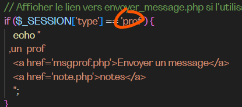

SALUT
déjà n'oublie pas dans le ficheir connexion de mettre le mdp 'root' 
explications des fichiers

index = le formulaire de connexion
les mdp c simple c pareil que les noms 
maria,maria
tania,tania
toto,toto ...
admin,admin

le fichier login.php , gère le système de connexion,
logout.php, la déconnexion, 
dans index ya un bout de code là , c'est le fitre ,le code ne s'appliquera que si la personne est conecté en tant que (ici prof), c'est ça que t met pour que seul un profil est accès, ajotue pour t'aider les liens vers tes pages dans le echo.

session_start();

if (isset($_SESSION['type']) && $_SESSION['type'] == 'prof') {
    echo "
   
   
   le code pour professeur
    ";
} else {
    // Redirigez l'utilisateur vers index.php s'il n'est pas connecté en tant que prof
    header("Location: index.php");
    exit(); // Assurez-vous de terminer le script après la redirection
}

normalement tu n'auras pas besoin de toucher mon code , juste créer tes structures, btw ouvre tjrs ça tout en haut de ton code php 
session_start();
ce code permet de deconnecter quand ça fait trop lgpts que ta été inanctif, c'est une bonne pratique. 
